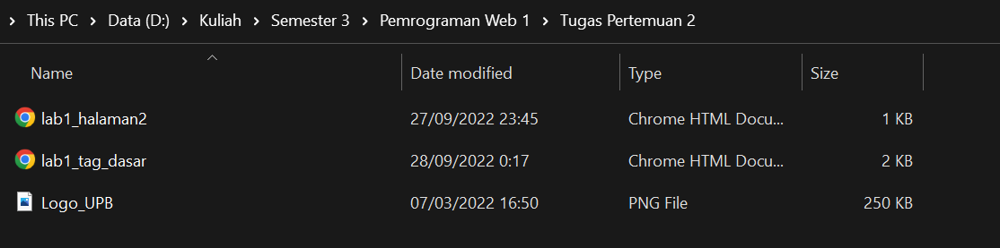

# Lab1Web
## Ananda Fachri Reynaldi
## 312110248
## TI.21.B1

1. Membuat file baru di VSCode dan menambahkan judul "Tag Dasar HTML"

2. Membuat paragraf 

3. Menambahkan judul paragraf dan mengatur posisi tulisan dengan atribut `align`

4. Memformat teks dan melakukan eksperimen menggunakan tag `<mark>`,`<b>`,`<i>`,`<ins>`

5. Menyisipkan gambar <br />
Catatan : File harus berada di dalam folder yang sama dengan file .html
 <br />

6. Menambahkan Hyperlink


## Jawab Pertanyaan Berikut
1. Lakukan perubahan pada kode sesuai dengan keinginan anda, amati perubahannya adakah error ketika terjadi kesalahan penulisan tag?
```
Saat terjadi kesalahan penulisan tag tidak ada error, hanya saja tidak terjadi perubahan.
```
2. Apa perbedaan dari tag `<p>` dengan tag `<br>`, berikan penjelasannya!
```
Tag <p> adalah perintah untuk membuat paragraf baru sedangkan tag <br> perintah untuk membuat garis baru. Perbedaannya tag <p> memiliki jarak dengan paragraf di atasnya sedangkan tag <br> tidak memiliki jarak dengan paragraf di atasnya. 
```
3. Apa perbedaan atribut title dan alt pada tag , berikan penjelasannya!
```
Perbedaannya adalah jika gambar berhasil ditampilkan dan jika kursor ada pada gambar tersebut maka akan muncul sebuah balon title. Sedangkan jika gambar gagal ditampilkan maka akan muncul teks dalam atribut alt tersebut.
```
4. Untuk mengatur ukuran gambar, digunakan atribut width dan height. Agar tampilan gambar proporsional sebaiknya kedua atribut tersebut diisi semua atau tidak? Berikan penjelasannya!
```
Agar tampilan gambar proporsional cukup mengisi salah satunya karena jika mengisi keduanya gambar tersebut akan berubah sesuai dengan ukuran yang kita mau sedangkan jika mengisi salah satunya maka atribut satunya akan menyesuaikan secara otomatis dan gambar akan proporsional.
```